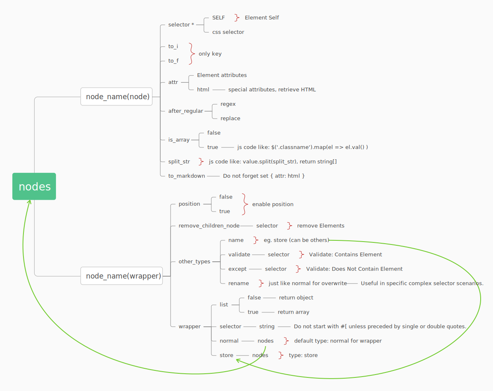

# Cheerio Tree

What is Cheerio Tree?

**Cheerio Tree** is a powerful utility built on **Cheerio**, designed for efficient DOM parsing. It enables rapid conversion of **HTML data into JSON format**. When paired with **YAML**, it provides an intuitive and streamlined approach to data handling and transformation.

## Install

```bash
npm install cheerio-tree

# or
yarn add cheerio-tree

# or
pnpm install cheerio-tree
```

## Dependencies

- [cheerio](https://github.com/cheeriojs/cheerio)
- [turndown](https://github.com/mixmark-io/turndown)

## Usage

### Easy YAML Config

Just look like:

```yaml
# ./config.yml
tree:
  nodes:
    title:
      selector: title
    body:
      selector: body
      attr: html
      to_markdown: true
    footer:
      selector: .footer
```

### Typescript

```typescript
import fs from 'fs';
import yaml from 'js-yaml';
import CheerioTree, { type CheerioTreeConfig } from 'cheerio-tree';

const config = fs.readFileSync('./config.yml', "utf-8");
const html = `
<html lang="en">
  <head>
    <title>Cheerio Tree</title>
  </head>
  <body>
    <h1>Cheerio Tree</h1>
    <main>
      <h2>What is Cheerio Tree?</h2>
      <p><b>Cheerio Tree</b> is a powerful utility built on <b>Cheerio</b>, designed for efficient DOM parsing. It enables rapid conversion of HTML data into JSON format. When paired with YAML, it provides an intuitive and streamlined approach to data handling and transformation.</p>
    </main>
  </body>
</html>
`
const configYaml = yaml.load(config) as CheerioTreeConfig;

const cheerioTree = new CheerioTree({ body: html });
const data = cheerioTree.parse({
  config: configYaml,
  beforeParse: ({cheerio}) =>{
    cheerio('body').append("<footer class='footer'>Append Text..</footer>")
  }
});
console.log(data);

```

output

```json
{
  "title": "Cheerio Tree",
  "body": "Cheerio Tree\n============\n\nWhat is Cheerio Tree?\n---------------------\n\n**Cheerio Tree** is a powerful utility built on **Cheerio**, designed for efficient DOM parsing. It enables rapid conversion of HTML data into JSON format. When paired with YAML, it provides an intuitive and streamlined approach to data handling and transformation.\n\nAppend Text..",
  "footer": "Append Text.."
}
```



### YAML Sample for Google SERP Scraper

Google SERP Scraper Config

```yaml
regexToI: &regexToI
  regex: '[^\d]'
  replace:
regexToF: &regexToF
  regex: '[^\d\.]'
  replace:

regexToK: &regexToK
  regex: 'K'
  replace: "000"

regexToM: &regexToM
  regex: 'M'
  replace: "000000"
  
regexToB: &regexToB
  regex: 'B'
  replace: "000000000"

# string to int
# eg. 1.1K will be 1100
toI: &toI
  - <<: *regexToK
  - <<: *regexToM
  - <<: *regexToB
  - <<: *regexToI

# serp item source
# ====================================
source: &source
  wrapper:
    list: false
    selector: a[jsname="UWckNb"]
    normal:
      title: 
        selector: h3
      name:
        selector: a[jsname="UWckNb"] span.VuuXrf
      display_link:
        selector: a[jsname="UWckNb"] .byrV5b cite
      link:
        selector: SELF
        attr: href

link: &link
  selector: a
  attr: href

rich_snippet: &rich_snippet
  wrapper:
    list: false
    selector: SELF
    normal:
      rated:
        wrapper:
          list: false
          selector: div[data-snf="mCCBcf"]
          other_types:
            - name: store
              validate:
                selector: span.z3HNkc.fUNJzc
            - name: normal
              validate:
                selector: span.z3HNkc:not(.fUNJzc)
          store:
            link:
              <<: *link
            label:
              selector: span[aria-label]
              attr: aria-label
            rating:
              to_f:
              selector: span[aria-hidden]
            reviews:
              selector: a
              to_i:
              after_regular: *toI 

            reviews_origin:
              selector: a
          normal:
            display_price:
              selector: span.LI0TWe.wHYlTd
            rating:
              selector: div > span:nth-child(2)
              to_f:
              after_regular:
                - <<: *regexToF
            label:
              selector: span[aria-label]
              attr: aria-label
            reviews:
              selector: div > span:nth-child(3)
              to_i:
              after_regular: *toI
            reviews_origin:
              selector: div > span:nth-child(3)
      extensions:
        selector: div[data-snf="mCCBcf"]

origin_search_normal: &origin_search_normal
  other_types:
    - name: twitter
      validate:
        selector: div.g.eejeod
    - name: site_links
      validate:
        selector: .BYM4Nd
    - name: video
      validate:
        selector: div[jscontroller="rTuANe"]
        except: '[jscontroller="UzbKLd"]'
    - name: book
      validate:
        selector: div.ChPIuf a[href*="tbm=bks"]
    - name: normal
      validate:
        selector: .g
        except: product-viewer-group
  normal:
    title:
      selector: .yuRUbf a[jsname="UWckNb"] h3
    snippet:
      selector: div[data-snf="nke7rc"]
      attr: html
      to_markdown: true
    source:
      <<: *source
    thumbnail:
      selector: div[data-snf="Vjbam"] img
      attr: src
    snippet_highlighted_words:
      selector: em
      is_array: true
    rich_snippet:
      <<: *rich_snippet
    links:
      wrapper:
        list: true
        selector:  div[data-snf="gdePb"] a
        normal:
          title: 
            selector: SELF
          link:
            selector: SELF
            attr: href


# Main
# ====================================================
# ====================================================
tree:
  url:
    match: https://www.google.com/search
    params: 
      q:
        name: query
        required: true
      gl:
        name: Country Code
      hl:
        name: lang code
      num:
        name: serp results
      start:
        name: offset

  nodes:
    meta:
      wrapper:
        list: false
        selector: body
        normal:
          query_displayed:
            selector: '#tsf textarea'
          result_stats:
            wrapper:
              list: false
              selector: div#result-stats
              normal:
                total_results:
                  selector: SELF
                  attr: html
                  after_regular:
                    - regex: '<nobr>.*</nobr>'
                      replace:
                    - regex: '[^\d]'
                      replace:
                time_taken_displayed:
                  selector: nobr
                  after_regular:
                    - regex: '[^\d\.]'
                      replace:
    origin_results:
      wrapper:
        list: false
        selector: div[id="rcnt"]
        normal:
          results:
            wrapper:
              remove_children_node:
                selector: .LEwnzc.Sqrs4e
              position: true
              list: true
              selector: '#rso > .MjjYud, #rso div > .MjjYud, #Odp5De'
              <<: *origin_search_normal
```

[src/__tests__/data/google/config.yml](src/__tests__/data/google/config.yml)

After parse, Google SERP JSON Sample

```json
{
    "meta": {
      "query_displayed": "cheerio",
      "result_stats": {
        "total_results": "23300000",
        "time_taken_displayed": "0.21"
      }
    },
    "origin_results": {
      "results": [
        {
          "type": "normal",
          "position": 1,
          "title": "Cheerio",
          "snippet": "The fast, flexible & elegant library for parsing and manipulating HTML and XML.",
          "source": {
            "title": "Cheerio",
            "name": "Cheerio",
            "display_link": "https://cheerio.js.org",
            "link": "https://cheerio.js.org/"
          },
          "snippet_highlighted_words": [],
          "links": [
            {
              "title": "Tutorial",
              "link": "https://cheerio.js.org/docs/intro"
            },
            {
              "title": "API",
              "link": "https://cheerio.js.org/docs/api"
            },
            {
              "title": "Blog",
              "link": "https://cheerio.js.org/blog"
            }
          ]
        },
        {
          "type": "normal",
          "position": 2,
          "title": "cheeriojs/cheerio: The fast, flexible, and elegant library for ...",
          "snippet": "The fast, flexible, and elegant library for parsing and manipulating HTML and XML. - cheeriojs/_cheerio_.",
          "source": {
            "title": "cheeriojs/cheerio: The fast, flexible, and elegant library for ...",
            "name": "GitHub",
            "display_link": "https://github.com › cheeriojs › cheerio",
            "link": "https://github.com/cheeriojs/cheerio"
          },
          "snippet_highlighted_words": [
            "cheerio"
          ],
          "links": [
            {
              "title": "Cheerio",
              "link": "https://github.com/cheeriojs"
            },
            {
              "title": "Issues 33",
              "link": "https://github.com/cheeriojs/cheerio/issues"
            },
            {
              "title": "Pull requests 14",
              "link": "https://github.com/cheeriojs/cheerio/pulls"
            },
            {
              "title": "Discussions",
              "link": "https://github.com/cheeriojs/cheerio/discussions"
            }
          ]
        },
        {
          "type": "normal",
          "position": 3,
          "title": "Cheerio",
          "snippet": "Tiny, fast, and elegant implementation of core jQuery designed specifically for the server. Latest version: 1.0.0-rc.12, last published: 2 ...",
          "source": {
            "title": "Cheerio",
            "name": "NPM",
            "display_link": "https://www.npmjs.com › package › cheerio",
            "link": "https://www.npmjs.com/package/cheerio"
          },
          "snippet_highlighted_words": []
        },
        ....
      ]
    }
  }
```


